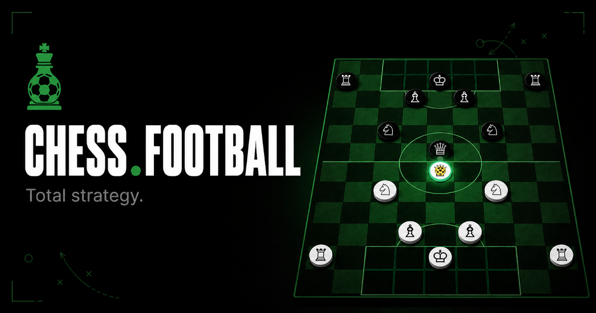

<p align="center">
  
</p>

# @scriptonita/chess-football-engine

Canonical **code** implementation of the Chess.Football rules engine — pure and framework-agnostic (no DOM, no Node APIs, no state-management library).

> **Rules source of truth:** the human-readable spec lives at
> [github.com/Scriptonita/chess.football](https://github.com/Scriptonita/chess.football).
> This package implements that spec in code and is consumed by every game client
> (the web app [Chess.Football](https://chess.football) and the -next- CrazyGames build). When the spec changes,
> update it here once, publish a new version, and bump the dependency in both games.

## Install

```bash
npm install @scriptonita/chess-football-engine
```

## Board overview

Chess.Football is played on a **9×12 grid** (columns A–I, ranks 1–12).

- **White** starts at the bottom (ranks 1–2 penalty area), **Black** at the top (ranks 11–12).
- Each side has one **King** (goalkeeper) restricted to its own penalty area, plus **Queen**, **Rooks**, **Bishops**, and **Knights** that cannot enter their own penalty area.
- Each turn a side has a configurable number of **Action Points (AP)** — **1–5, default 5** (`maxActionPoints`). Moving or passing costs 1 AP. The turn ends when all AP are spent, a pass is intercepted, or the player calls `applyEndTurn`.
- Passing flies over pieces. The first enemy on the path either intercepts (non-king) or concedes a goal (king).

## API Reference

### Types

```ts
import type {
  Side, PieceType, Position, Piece, Ball,
  BoardState, MoveHistoryEntry, MoveHistoryType,
  GameStatus, Match,
  AIAction, AIPlayerScript,
} from '@scriptonita/chess-football-engine'
```

#### `Side`
```ts
type Side = 'white' | 'black'
```

#### `PieceType`
```ts
type PieceType = 'king' | 'queen' | 'rook' | 'bishop' | 'knight'
```

#### `Position`
```ts
interface Position {
  x: number  // 0–8  → columns A–I
  y: number  // 0–11 → ranks 1–12
}
```

#### `Piece`
```ts
interface Piece {
  id: string              // e.g. "white_queen", "black_rook_1"
  type: PieceType
  side: Side
  pos: Position
  hasMovedThisTurn: boolean
}
```

#### `Ball`
```ts
interface Ball {
  pos: Position
  holderId: string | null  // Piece.id of the holder, or null if loose on the board
}
```

#### `MoveHistoryType`
```ts
type MoveHistoryType = 'move' | 'pass' | 'tackle' | 'goal' | 'interception'
```

#### `MoveHistoryEntry`
```ts
interface MoveHistoryEntry {
  type: MoveHistoryType
  pieceType: PieceType
  pieceSide: Side
  from?: Position
  to: Position
  at: number       // Unix timestamp (ms)
  turnNumber: number
}
```

#### `BoardState`

The complete, self-contained snapshot of the game at any point in time.

```ts
interface BoardState {
  pieces: Piece[]
  ball: Ball
  score: { white: number; black: number }
  actionPoints: number       // AP remaining in the current turn (1–5)
  maxActionPoints?: number   // Defaults to 5
  turn: Side                 // Whose turn it is
  turnNumber: number
  lastMove?: {
    type: MoveHistoryType
    from?: Position
    to: Position
    playerId: string
    at: number
  }
  moveHistory: MoveHistoryEntry[]  // Last 60 entries
  kingMustRelease?: Side    // This side's king must pass the ball this turn or lose it
  keeperBlockedId?: string  // This keeper cannot receive passes until an opponent touches the ball
}
```

#### `AIAction`
```ts
interface AIAction {
  type: 'move' | 'pass' | 'end_turn'
  pieceId?: string  // Required for 'move' and 'pass'
  to?: Position     // Required for 'move' and 'pass'
}
```

#### `AIPlayerScript`
```ts
interface AIPlayerScript {
  name: string
  description: string
  avatar: string                                          // Emoji identifier
  difficulty: 'beginner' | 'intermediate' | 'advanced' | 'expert'
  badgeName: string                                       // Trophy awarded to the player who beats this AI
  badgeIcon: string                                       // Lucide icon name for the badge
  play: (boardState: BoardState, aiSide: Side) => AIAction[]
  // Pure function. Called once per AI turn. Returns up to 5 actions (one per AP).
}
```

---

### Rules / Movement

```ts
import {
  getValidMoves, getValidPasses, checkGoal,
  isInOwnArea, isInEnemyArea, getAreaForSide,
  WHITE_AREA, BLACK_AREA,
} from '@scriptonita/chess-football-engine'
```

#### `WHITE_AREA` / `BLACK_AREA`

```ts
const WHITE_AREA = { xMin: 2, xMax: 6, yMin: 0,  yMax: 1  }  // columns C–G, ranks 1–2
const BLACK_AREA = { xMin: 2, xMax: 6, yMin: 10, yMax: 11 }  // columns C–G, ranks 11–12
```

The penalty areas where each King is confined.

#### `getAreaForSide(side)`

```ts
function getAreaForSide(side: Side): { xMin: number; xMax: number; yMin: number; yMax: number }
```

Returns `WHITE_AREA` or `BLACK_AREA` for the given side.

#### `isInOwnArea(pos, side)`

```ts
function isInOwnArea(pos: Position, side: Side): boolean
```

Returns `true` if `pos` falls inside `side`'s own penalty area.

#### `isInEnemyArea(pos, side)`

```ts
function isInEnemyArea(pos: Position, side: Side): boolean
```

Returns `true` if `pos` falls inside the opponent's penalty area.

#### `getValidMoves(piece, boardState)`

```ts
function getValidMoves(piece: Piece, boardState: BoardState): Position[]
```

Returns all positions the piece can legally move to, according to Chess.Football rules:

- **King** — one square in any direction, restricted to its own penalty area.
- **Queen** — any number of squares horizontally, vertically, or diagonally (blocked by pieces).
- **Rook** — any number of squares horizontally or vertically.
- **Bishop** — any number of squares diagonally.
- **Knight** — standard L-shaped jumps, ignores pieces in between.
- No piece (except King) can enter its own penalty area.
- A piece can move to an opponent's square **only** if that opponent holds the ball and there is an adjacent empty square to displace them to (tackle).

#### `getValidPasses(piece, boardState)`

```ts
function getValidPasses(piece: Piece, boardState: BoardState): Position[]
```

Returns all squares the ball holder can pass to. Passes fly over all pieces — blocking is not checked here (interceptions are resolved inside `applyPass`). The keeper-blocked rule is applied: a keeper with `keeperBlockedId` cannot receive passes until an opponent touches the ball.

#### `checkGoal(boardState)`

```ts
function checkGoal(boardState: BoardState): Side | null
```

Returns which side just scored, or `null` if no goal occurred. A goal is detected when `boardState.lastMove.type === 'goal'`.

---

### Engine (state transitions)

```ts
import {
  applyMove, applyPass, applyEndTurn, getPath,
} from '@scriptonita/chess-football-engine'
import type { MoveResult, PassResult } from '@scriptonita/chess-football-engine'
```

All functions are **pure**: they receive a `BoardState` and return a new one without mutating the input.

> These functions do **not** validate legality. Always call `getValidMoves` / `getValidPasses` first and only pass legal targets.

#### `applyMove(boardState, pieceId, to)`

```ts
function applyMove(boardState: BoardState, pieceId: string, to: Position): MoveResult

type MoveResult = {
  boardState: BoardState
  moveType: 'move' | 'tackle'
}
```

Moves a piece to `to`. Handles:

- **Ball conduction** — if the piece holds the ball it moves with it.
- **Ball capture** — linear pieces that cross the ball's square pick it up; knights pick it up by landing on it.
- **Tackle** — if `to` is occupied by an opponent who holds the ball, the ball is stolen and the opponent is displaced to an adjacent empty square.
- **AP management** — decrements `actionPoints`; ends the turn and switches `turn` when AP reaches 0.
- **King possession penalty** — if the King ends a turn still holding the ball a first time, `kingMustRelease` is set for the next turn; on the second consecutive offence the ball is auto-released.

#### `applyPass(boardState, to)`

```ts
function applyPass(boardState: BoardState, to: Position): PassResult

type PassResult = {
  boardState: BoardState
  forcedTurnEnd: boolean  // true when the pass was intercepted or a goal was scored
  goalScored: boolean
}
```

Passes the ball from the current holder toward `to`. Handles:

- **Goal** — if the rival King is the first piece on the path, `goalScored` is `true` and the turn ends.
- **Interception** — if any other rival piece is the first on the path, it picks up the ball and the turn ends.
- **Normal pass** — ball lands at `to`; if a teammate is there they become the new holder.
- **King release rule** — when the King passes the ball, `keeperBlockedId` is set so the King cannot receive it back until the opponent touches it.

#### `applyEndTurn(boardState)`

```ts
function applyEndTurn(boardState: BoardState): BoardState
```

Manually ends the current side's turn. Resets `actionPoints` to `maxActionPoints` (default 5), increments `turnNumber`, resets `hasMovedThisTurn` on all pieces, and enforces the King possession penalty if applicable.

#### `getPath(from, to)`

```ts
function getPath(from: Position, to: Position): Position[]
```

Returns every position along the straight line from `from` to `to`, **including** `to` and **excluding** `from`. Used internally by `applyPass` and ball-capture logic.

---

### Notation

```ts
import {
  squareName, FILE_LABELS, RANK_LABELS, SHORT_KEY, LONG_KEY,
} from '@scriptonita/chess-football-engine'
```

#### `squareName(pos)`

```ts
function squareName(pos: Position): string
// squareName({ x: 3, y: 4 }) → "D5"
```

Converts an internal `Position` to algebraic notation (column letter + rank number).

#### `FILE_LABELS`

```ts
const FILE_LABELS: readonly string[]  // ["A", "B", "C", "D", "E", "F", "G", "H", "I"]
```

#### `RANK_LABELS`

```ts
const RANK_LABELS: readonly number[]  // [1, 2, 3, 4, 5, 6, 7, 8, 9, 10, 11, 12]
```

#### `SHORT_KEY` / `LONG_KEY`

```ts
const SHORT_KEY: Record<PieceType, PieceShortKey>
const LONG_KEY:  Record<PieceType, PieceLongKey>
```

Maps each `PieceType` to an i18n key for use in UI translation dictionaries.

---

### AI opponents

```ts
import { getAIScript } from '@scriptonita/chess-football-engine'
```

#### `getAIScript(scriptId)`

```ts
function getAIScript(scriptId: string): AIPlayerScript | null
```

Returns the `AIPlayerScript` for the given ID, or `null` if not found.

| `scriptId` | Name | Difficulty |
|---|---|---|
| `'claude-tactico'` | Claude Sonnet | advanced |
| `'chatgpt-tactico'` | Táctico Neural | advanced |
| `'gemini-tikitaka'` | TikiTaka_AI | advanced |

The `play` method on each script is a **pure, synchronous** function — no network calls, no randomness.

```ts
const ai = getAIScript('claude-tactico')!
const actions: AIAction[] = ai.play(boardState, 'black')

for (const action of actions) {
  if (action.type === 'move')     boardState = applyMove(boardState, action.pieceId!, action.to!).boardState
  if (action.type === 'pass')     boardState = applyPass(boardState, action.to!).boardState
  if (action.type === 'end_turn') boardState = applyEndTurn(boardState)
}
```

---

## Full usage example

```ts
import {
  getValidMoves,
  getValidPasses,
  applyMove,
  applyPass,
  applyEndTurn,
  checkGoal,
  squareName,
  getAIScript,
} from '@scriptonita/chess-football-engine'

// boardState is provided by each game client (the initial state lives there, not here)

// 1. Get legal moves for a piece
const queen = boardState.pieces.find(p => p.id === 'white_queen')!
const moves = getValidMoves(queen, boardState)
console.log('Queen can move to:', moves.map(squareName))

// 2. Move the queen
const { boardState: afterMove } = applyMove(boardState, 'white_queen', moves[0])

// 3. Get valid passes if queen now holds the ball
if (afterMove.ball.holderId === 'white_queen') {
  const passes = getValidPasses(queen, afterMove)
  const { boardState: afterPass, goalScored } = applyPass(afterMove, passes[0])
  if (goalScored) console.log('GOAL!')
}

// 4. End the turn manually
const nextTurn = applyEndTurn(boardState)

// 5. Run an AI turn
const ai = getAIScript('gemini-tikitaka')!
const actions = ai.play(boardState, 'black')
```

## What's NOT included

These are kept per-app intentionally:

- `getInitialBoardState` — initial piece placement and setup.
- Zustand store / React state — state orchestration lives in each game client.

## Scripts

```bash
npm run build      # tsup → ESM + CJS + .d.ts in dist/
npm run typecheck  # tsc --noEmit over src/
npm test           # vitest (rules test suite)
```

## License

MIT
